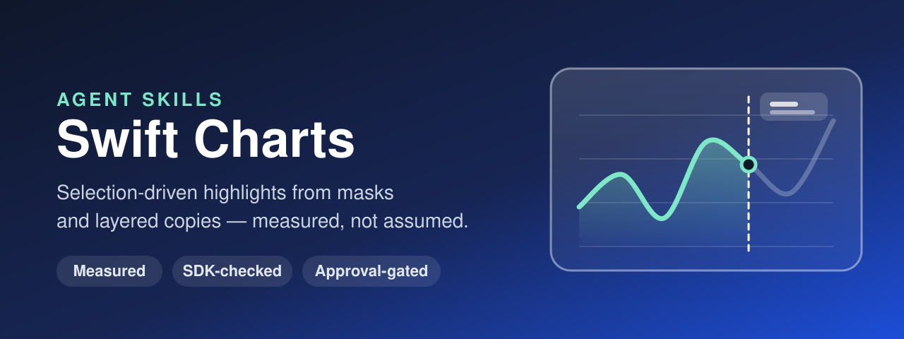

<p align="center">
  
</p>

# Swift Charts Agent Skills

[](https://github.com/alexey1312/Swift-Charts-Agent-Skill/actions/workflows/validate.yml)
[](LICENSE)
[](https://github.com/alexey1312/Swift-Charts-Agent-Skill/releases)

**Agent Skills for Swift Charts techniques that are easy to get almost right.**
The first skill builds the TradingView-style scrub —
everything left of the finger at full strength, the rest dimmed —
and the effects made the same way:
a highlighted range, actual versus forecast on one line, a reveal up to a date.
The skills work in any AI coding tool that supports the
[Agent Skills open format](https://agentskills.io/home).

The technique comes from Anton Gubarenko's article
[*SwiftUI Charts: Dynamic Masking*](https://antongubarenko.substack.com/p/swiftui-charts-dynamic-masking):
never change the data to show part of it;
plot complete copies and change only what a mask reveals and how opaque each copy is.
This repository turns it into a repeatable workflow —
scan the project, check what the SDK and the deployment target allow,
propose a plan where every item cites a source, change code only after approval —
and measures the parts the article leaves to the reader.

## What the measurements changed

A probe in this repository renders the technique and compares pixels
([`measured-behavior.md`](skills/swift-charts-dynamic-masking/references/measured-behavior.md)).
Four of its results change the code you would otherwise write:

- **A mask from the first data point cuts the first point in half**
  (68 px of its symbol and line cap, in the probe),
  and one that falls back to the last point cuts the last.
  Masking from the edges of a padded domain leaves the chart pixel-identical.
- **Mask marks and selection rules count toward an automatic x domain.**
  A rule that follows a raw selection past the data rescales the whole chart mid-drag.
- **Nothing clamps a selection.**
  At the plot's padded edge it was already 6.3 hours outside the data;
  30 pt outside the plot, 18 hours.
  Snapping to the nearest point clamps for free.
- **Gradient stops spaced by index land on the wrong points** when the data is unevenly spaced.

The article's own fix — a distinct `series:` for each copy of the line —
is confirmed: without it, Swift Charts joins the end of one copy to the start of the other,
and a different constant color does not prevent it.
It is not only about copies:
two plots holding the solid and the dashed half of a line, without series,
drew as one solid line — the dash lost.

## Who this is for

- iOS teams adding scrubbing, range highlights or forecast styling to Swift Charts
- Charts that filter their data on every drag, or hand-roll a `DragGesture` in `chartOverlay`
- Apps that deploy below iOS 18 or 17 and need the same effect without `LinePlot` or `chartXSelection`

## What it checks

- **Joined lines** — two copies of one line, or two halves, without distinct series
- **Sliced data** — data filtered or cut by the selection
- **Cut edge points** — a mask that starts on the first point or falls back to the last
- **Raw selection in marks** — values past the data that rescale an automatic domain
- **Wrong tooltip day** — a popover that formats the raw selection next to the nearest point's value
- **Layer mismatch** — copies with different interpolation methods
- **Accessibility** — more than one copy of the data readable by VoiceOver
- **Waste** — a mask drawn once per data element
- **SDK reality** — the iOS version each API needs, read from the SDK's own Swift interface

Every rule and its source is listed in [CHECKS.md](CHECKS.md).

## Plan before patch

"Make the chart work like TradingView" is permission to investigate, not to rewrite.
Before anything changes you get, for every recommendation:

- A stable item ID you can approve
- The finding with `file:line`
- What goes wrong, and the session, documentation page or measurement it rests on
- Whether the deployment target allows the API, or which gate it needs
- Risk, and which selection states to verify

Nothing is edited until you approve item IDs.
States that were not rendered are reported as *not verified*, never as passing.

## How it works

The skill ships two read-only Python scripts,
so your agent reasons over structured JSON instead of ad-hoc grep output.

**When it triggers:**

- You want part of a Swift Charts chart bright and the rest dimmed or hidden,
  following a selection or a fixed date.
- You mention `chartXSelection`, `ChartContent.mask`, `RectangleMark` masks,
  a dimmed copy of a `LinePlot`, or the series of layered lines.
- Your chart shows a line from its end back to its start, half-cut end points,
  rescales while dragging, or labels a point with the wrong day.

**What you can ask:**

- `Make this chart dim everything after my finger, like TradingView. Plan first.`
- `A straight line shoots from the right end of the chart back to the left when I touch it. Fix it.`
- `We deploy to iOS 16 — how do we get the scrub effect without chartXSelection?`
- `Draw actual and forecast as one line: solid until today, dashed after.`

**Under the hood:**

- `scripts/charts_scan.py` — walks Swift files and build settings;
  finds `Chart` blocks, their layers, modifier chains, masks and selection bindings;
  emits findings with stable IDs, severity, citation and advice,
  plus the deployment targets and an inventory. Never writes.
- `scripts/charts_sdk_check.py` — reads `Charts.swiftinterface` from the selected SDK
  and reports the iOS version each API in the skill needs.
- `scripts/typecheck_samples.py` (repository) — compiles every Swift block in the
  references at its stated iOS version, and checks it fails one version below.
- `scripts/probes/masking_probe.swift` (repository) — the renders and pixel
  comparisons behind every *Measured* statement.

## The skills

| Skill | What it does |
| --- | --- |
| [`swift-charts-dynamic-masking`](skills/swift-charts-dynamic-masking/SKILL.md) | Selection-driven highlights built from masks and layered copies: the scrub, range highlights, actual versus forecast; selection snapping, series, accessibility, iOS 16–18 variants |

## How to Use These Skills

### Option A: Using skills.sh

```bash
npx skills add https://github.com/alexey1312/Swift-Charts-Agent-Skill
```

Then, in your agent:

> Use the Swift Charts dynamic masking skill to plan a scrub effect for this chart.

### Option B: Claude Code Plugin

#### Personal Usage

1. Add the marketplace:

```bash
/plugin marketplace add alexey1312/Swift-Charts-Agent-Skill
```

2. Install the plugin:

```bash
/plugin install swift-charts-skills@swift-charts-skills
```

#### Project Configuration

To provide the skills to everyone working in a repository,
configure the repository's `.claude/settings.json`:

```json
{
  "enabledPlugins": {
    "swift-charts-skills@swift-charts-skills": true
  },
  "extraKnownMarketplaces": {
    "swift-charts-skills": {
      "source": {
        "source": "github",
        "repo": "alexey1312/Swift-Charts-Agent-Skill"
      }
    }
  }
}
```

### Option C: Codex / OpenAI-compatible tools

This repository includes an `agents/openai.yaml` manifest.
Copy or symlink the skill folders into your Codex skills directory:

```bash
cp -R skills/swift-charts-* "$CODEX_HOME/skills/"
```

### Option D: Using pi package manager

```bash
pi install https://github.com/alexey1312/Swift-Charts-Agent-Skill
```

### Option E: Manual install

1. **Clone** this repository.
2. **Install or symlink** the folders under `skills/` following your tool's skills docs.
3. **Ask your AI tool** to use the `swift-charts-dynamic-masking` skill on your project.

Or download a single `.skill` archive from the
[latest release](https://github.com/alexey1312/Swift-Charts-Agent-Skill/releases/latest).

#### Where to Save Skills

- **Codex:** [Where to save skills](https://developers.openai.com/codex/skills/#where-to-save-skills)
- **Claude:** [Using Skills](https://docs.claude.com/en/docs/agents-and-tools/agent-skills/overview)
- **Cursor:** [Enabling Skills](https://cursor.com/docs/context/skills#enabling-skills)

**How to verify:**
your agent should run the bundled scan and SDK check first,
present a plan with item IDs and sources,
and wait for you to approve items before editing.
With a deployment target below iOS 18 it should not write `LinePlot` without a gate.

## Skill Structure

```text
skills/
  swift-charts-dynamic-masking/
    SKILL.md                      Composition, mask, selection, workflow, guardrails
    references/
      masking-code.md             Compiled recipes: scrub, iOS 16 marks, range, forecast, gradient
      measured-behavior.md        What the probe measured, with the numbers
      api-availability.md         iOS version of every API, from the SDK
      selection-state-matrix.md   States to verify, and how to pin them
      recommendation-format.md    Plan items and report skeleton
      sources.md                  Sessions, documentation, and the article
    scripts/                      charts_scan.py, charts_sdk_check.py
    evals/                        skill-creator evals and fixture projects
scripts/
  typecheck_samples.py            Compiles the references' Swift at each iOS floor
  build_plugin_evals.py           Stages the evals as a `claude plugin eval` suite
  package_skills.py               Builds the .skill archives for a release
  probes/masking_probe.swift      The measurements
tests/                            Deterministic unit tests
benchmarks/                       claude plugin eval results, with a write-up
CHECKS.md                         Every automated and manual check, with sources
```

## Benchmark

Five cases, three runs each, with and without the skill
([`benchmarks/2026-10-01`](benchmarks/2026-10-01/README.md)):
**0.95 with the skill against 0.69 without**, as graded.
Three of the four with-skill misses were the judge's;
the write-up says which, and where the baseline did as well as the skill.

## This skill's approach

- **Grounded:** every recommendation cites an Apple session and timestamp,
  a documentation page, or a measured section; anything else is labelled *inference*.
- **Measured:** where the article and a render disagree, the render wins,
  and the probe that produced it is committed.
- **SDK-honest:** availability comes from the SDK's Swift interface,
  and every sample compiles at its stated iOS version and fails below it.
- **Token efficient:** one scan returns compact JSON instead of dozens of searches.
- **Safe by design:** read-only by default, approval before edits,
  rescan and verify after.

## Sources

- [SwiftUI Charts: Dynamic Masking](https://antongubarenko.substack.com/p/swiftui-charts-dynamic-masking) — Anton Gubarenko, the technique
- [Explore pie charts and interactivity in Swift Charts](https://developer.apple.com/videos/play/wwdc2023/10037/) — WWDC23, selection
- [Swift Charts: Vectorized and function plots](https://developer.apple.com/videos/play/wwdc2024/10155/) — WWDC24, `LinePlot` and `AreaPlot`
- [Swift Charts: Raise the bar](https://developer.apple.com/videos/play/wwdc2022/10137/) — WWDC22, `ChartProxy`, overlays, accessibility
- [Hello Swift Charts](https://developer.apple.com/videos/play/wwdc2022/10136/) — WWDC22
- [Swift Charts documentation](https://developer.apple.com/documentation/charts) — `LineMark` series, `mask(content:)`, `chartXSelection`, `ChartProxy`

Timestamps and the line-by-line comparison with the article:
[sources.md](skills/swift-charts-dynamic-masking/references/sources.md).

## Contributing

Contributions are welcome — especially measurements on an iOS simulator or device,
SDK updates when a new Xcode ships, and false positives found on real projects.
Please read [CONTRIBUTING.md](CONTRIBUTING.md).

## About the author

Created by [Aleksei Kakoulin](https://github.com/alexey1312),
on the model of [iPhone Duo Agent Skills](https://github.com/alexey1312/iPhone-Duo-Agent-Skill).
The masking technique is Anton Gubarenko's;
Swift Charts guidance is Apple's.
This project is not affiliated with Apple.

## License

This project is open-source and available under the MIT License.
See [LICENSE](LICENSE) for details.
